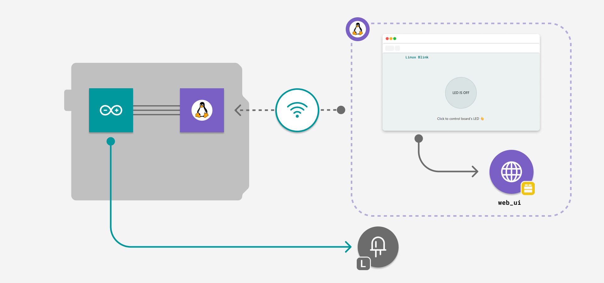
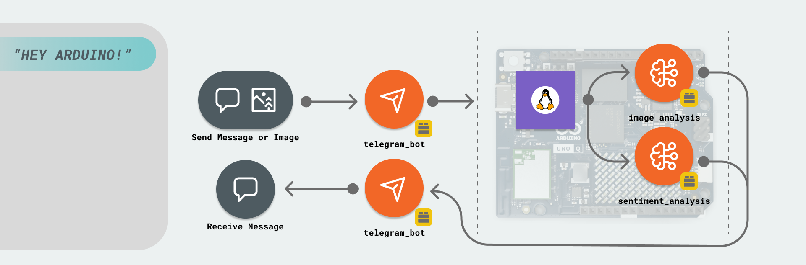
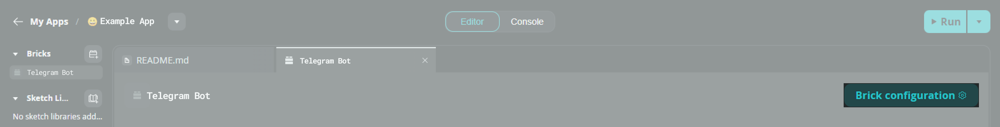
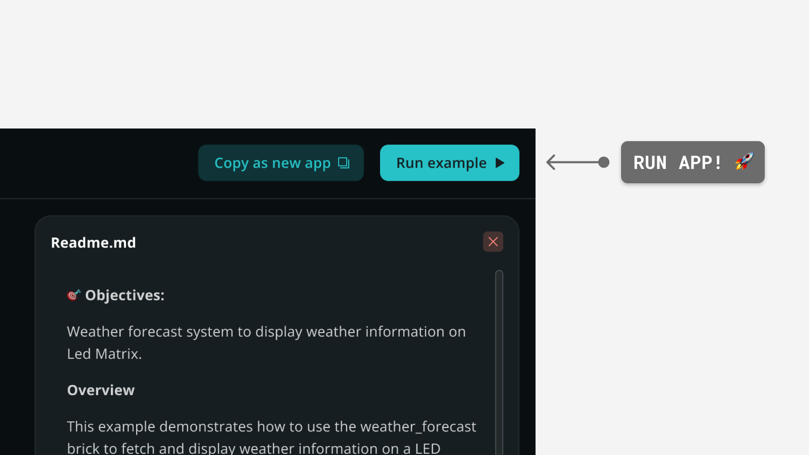
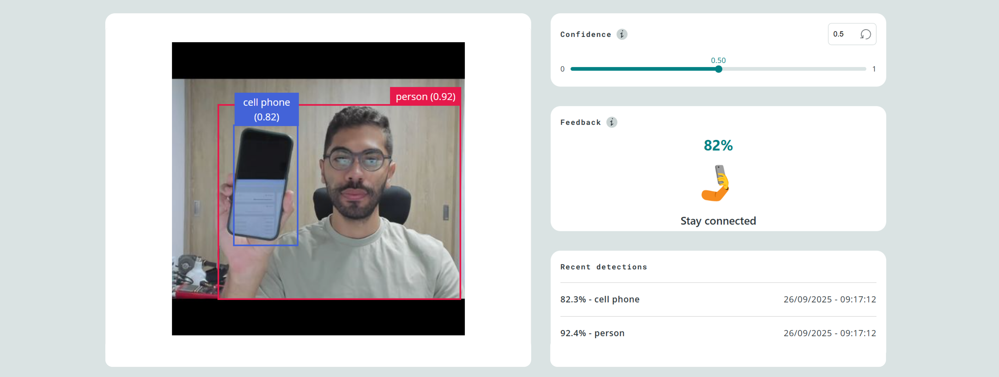
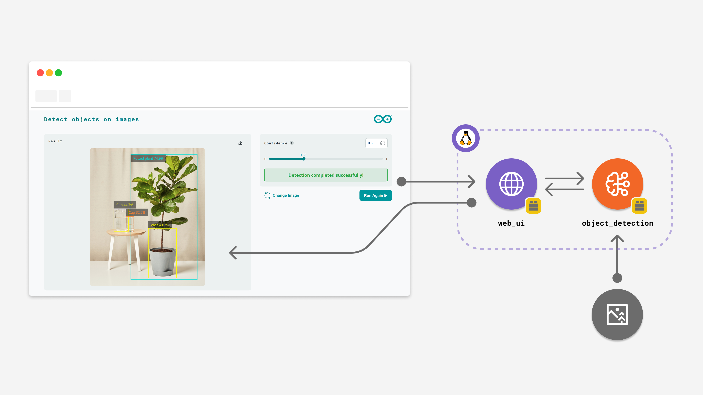
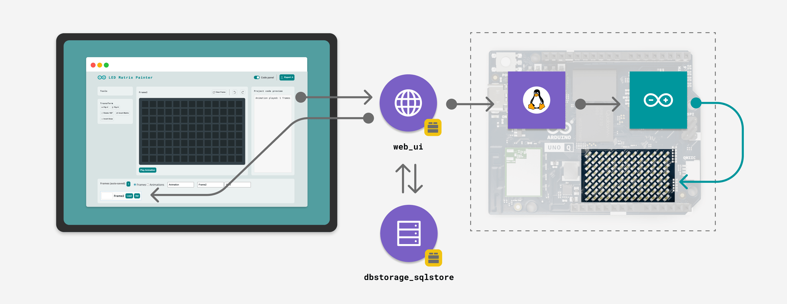
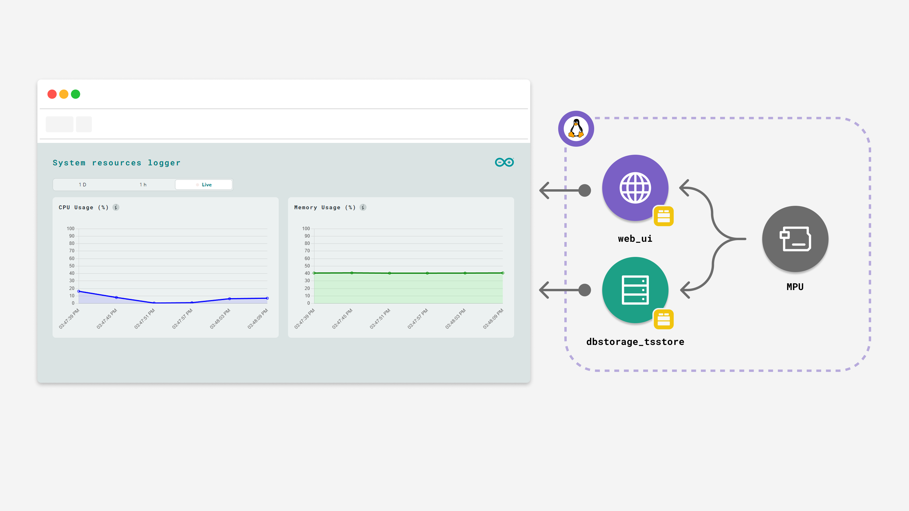
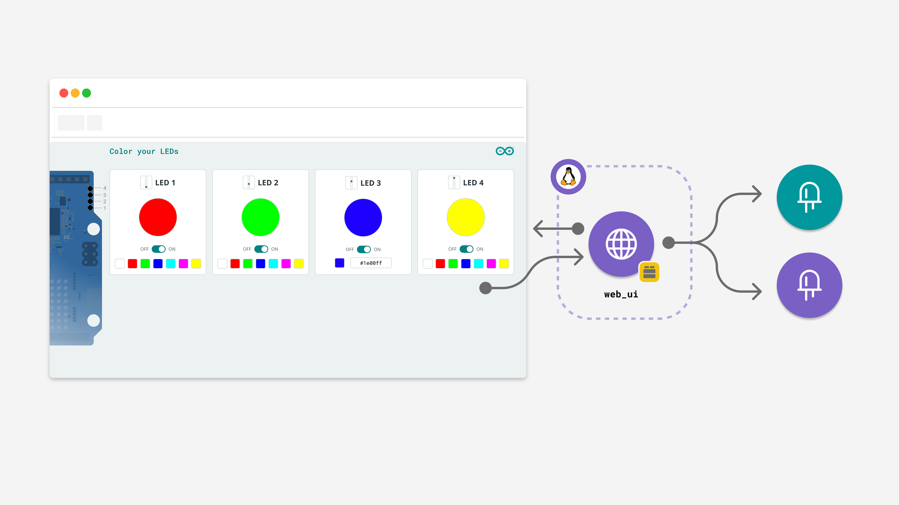

# ARIA — Step Four: Integrated Robot Platform 🤖

**ARIA (Autonomous Robotic Intelligence Architecture)** is a fully integrated robotics platform running on the **Arduino UNO Q**. It combines EKF-based navigation, a live-streaming camera with AI object detection, a Telegram remote-control interface, and a real-time web dashboard — all in a single application.



---

## What's Inside

ARIA Step Four is the integration of three prior projects into one cohesive app:

| Project | Role in ARIA |
|---|---|
| [`UnoQXRPEKF-step-two`](../UnoQXRPEKF-step-two) | 🧭 Robot Brain — EKF navigation, motor control, occupancy grid, web UI |
| [`telegram-bot-step-three`](../telegram-bot-step-three) | 📱 Remote Control — Full Telegram bot interface for all robot functions |
| [`object-detection`](../object-detection) + [`video-generic-object-detection`](../video-generic-object-detection) | 👁️ Vision — Live camera stream + AI object detection |

---

## Architecture

```
┌────────────────────────────────────────────────────────┐
│                  Arduino UNO Q (Linux)                  │
│                                                        │
│  ┌─────────────┐  ┌──────────────┐  ┌──────────────┐  │
│  │  Web UI     │  │ Telegram Bot │  │  Camera AI   │  │
│  │  :7000      │  │  (remote)    │  │  :4912/embed │  │
│  └──────┬──────┘  └──────┬───────┘  └──────┬───────┘  │
│         │                │                  │           │
│         └────────────────┴──────────────────┘           │
│                          │                              │
│         ┌────────────────▼──────────────────┐           │
│         │           main.py                 │           │
│         │  - EKF navigation loop            │           │
│         │  - Motor control                  │           │
│         │  - Telemetry & occupancy grid     │           │
│         │  - Telegram command handlers      │           │
│         │  - Camera detection callbacks     │           │
│         └────────────────┬──────────────────┘           │
│                          │ Serial (USB)                 │
│         ┌────────────────▼──────────────────┐           │
│         │         Arduino sketch.ino         │           │
│         │  - Encoder + IMU bridge            │           │
│         │  - Motor PWM output                │           │
│         └───────────────────────────────────┘           │
└────────────────────────────────────────────────────────┘
```

---

## Bricks Used

| Brick | Purpose |
|---|---|
| `arduino:web_ui` | Serves the real-time web dashboard at `:7000` |
| `arduino:telegram_bot` | Full Telegram bot remote control interface |
| `arduino:object_detection` | AI object detection on uploaded images |
| `arduino:mood_detector` | Sentiment analysis for Telegram text messages |
| `arduino:video_object_detection` | Live USB camera stream + real-time detection at `:4912/embed` |

---

## Hardware Requirements

- **Arduino UNO Q** (x1) — runs the full application as a Linux SBC
- **USB-C hub** with external power (5 V, 3 A) — for USB camera + connectivity
- **USB camera** (x1) — for live stream and object detection
- **Robot chassis** with two DC motors + encoders
- **IMU** (Nano 33 BLE Sense or similar) connected via Serial

---

## Software Requirements

- **Arduino App Lab**
- A **Telegram account** + bot token from [@BotFather](https://t.me/BotFather)
- Python dependencies (installed automatically or via `pip install -r python/requirements.txt`):
  - `filterpy`, `numpy`, `pyserial`, `matplotlib`, `Pillow`

---

## How to Set Up

### 1. Create a Telegram Bot



1. Open Telegram and search for **@BotFather**
2. Send `/newbot` and follow the prompts
3. Copy your **API token** (format: `123456789:AA...`)

### 2. Configure the Telegram Brick



In Arduino App Lab, open the **ARIA-step-four** app, click the **Telegram Bot** brick in the left panel → **Brick Configuration**, and paste your token.

### 3. Connect Hardware

1. Connect your robot chassis motors and encoders to the Arduino (sketch side)
2. Plug the USB camera into the UNO Q via the USB-C hub
3. Connect power to the hub

### 4. Run the App



Click **Run** in Arduino App Lab. The app will:
- Open the web dashboard automatically at `http://<board-name>.local:7000`
- Start the Telegram bot (ready to receive commands)
- Start the live camera stream at `http://<board-name>.local:4912/embed`

---

## Web Dashboard

The web UI has four tabs:

| Tab | What it shows |
|---|---|
| ⚙️ **Control** | Motor on/off toggle, speed slider, live IMU + encoder data |
| 🗺️ **Map** | Interactive occupancy grid — click to set waypoints, draw clean zones |
| 📐 **Pose** | Real-time EKF position (X, Y, θ) and distance from origin |
| 📷 **Camera** | Live annotated camera stream, snapshot, upload + detect, detections log |

---

## Telegram Commands

### 🎮 Movement
| Command | Action |
|---|---|
| `/forward [speed]` | Drive forward |
| `/backward [speed]` | Drive backward |
| `/left` | Spin left |
| `/right` | Spin right |
| `/stop` | Emergency stop |
| `/speed <0-255>` | Set motor speed |
| `/mode <auto\|manual>` | Switch driving mode |

### 🧹 Cleaning
| Command | Action |
|---|---|
| `/clean` | Full-room lawnmower pattern |
| `/cleanzone x1 y1 x2 y2` | Clean a rectangular zone (in cm) |
| `/stopclean` | Abort cleaning |
| `/dock` | Return to saved dock position |
| `/setdock` | Save current position as dock |

### 📍 Navigation
| Command | Action |
|---|---|
| `/goto <name>` | Navigate to a named saved area |
| `/areas` | List all saved areas |
| `/savearea <name>` | Save current position as a named area |
| `/deletearea <name>` | Delete a saved area |
| `/cancelpath` | Cancel current navigation |

### 📊 Status & Telemetry
| Command | Action |
|---|---|
| `/status` | Full status: mode, speed, pose, coverage |
| `/pose` | EKF position X, Y, θ |
| `/sensors` | Raw encoder + IMU data |
| `/coverage` | Occupancy grid coverage % |
| `/battery` | Battery level *(hardware stub)* |

### 📷 Camera & Vision
| Command | Action |
|---|---|
| `/photo` | Capture and send live camera snapshot |
| `/detect` | Snapshot + list current detected objects |
| *(Send a photo)* | Run AI object detection on any image you send |



### 🗺️ Map
| Command | Action |
|---|---|
| `/map` | Render and send the occupancy grid as an image |
| `/heatmap` | Dirt heatmap *(coming soon)* |
| `/resetpose` | Reset EKF to origin (0, 0, 0°) |

### 🔧 Utilities
| Command | Action |
|---|---|
| `/ping` | Check bot is alive |
| `/help` | Full command list |
| `/hello` | Greeting |
| *(Send any text)* | AI mood/sentiment analysis |

---

## Live Camera


The camera tab streams live annotated video directly from the `video_object_detection` brick:
- **Bounding boxes** drawn in real-time on detected objects
- **Confidence slider** to tune detection sensitivity
- **📸 Snapshot** button to capture a still frame
- **📂 Upload + Detect** to run detection on any uploaded image
- **Recent Detections** list updated live as objects are spotted

---

## How It Works — Data Flow

```
USB Camera
    │
    ▼
VideoObjectDetection brick ──► annotated MJPEG ──► browser iframe :4912/embed
    │
    ├──► on_detect_all() ──► ui.send_message("detection") ──► web detections list
    │
    └──► camera.on_detections() ──► /detect Telegram command

Encoders + IMU (Arduino sketch)
    │  Serial
    ▼
serial_bridge.py ──► telemetry.py (EKF + occupancy grid)
    │
    ├──► ui.send_message("ekf_update")  ──► Pose tab live update
    ├──► ui.send_message("map_update")  ──► Map tab live render
    └──► navigator.py step() ──► motor.py ──► motors move
```

---

## Project Structure

```
ARIA-step-four/
├── app.yaml                  # Bricks manifest
├── README.md                 # This file
├── assets/
│   ├── index.html            # Web UI (4 tabs: Control, Map, Pose, Camera)
│   ├── app.js                # UI logic + Socket.IO handlers
│   ├── style.css             # Styling
│   └── docs_assets/          # Images for this README
├── python/
│   ├── main.py               # Combined app entry point (467+ lines)
│   ├── camera.py             # Camera helper (snapshot from brick stream)
│   ├── motor.py              # Motor command sender
│   ├── navigator.py          # Waypoint following + A* path planner
│   ├── telemetry.py          # EKF + dead reckoning + occupancy grid
│   ├── serial_bridge.py      # Arduino serial communication
│   ├── requirements.txt      # Python dependencies
│   └── aria/                 # EKF, occupancy grid, A* modules
└── sketch/
    ├── sketch.ino            # Arduino encoder + IMU bridge
    └── sketch.yaml           # Build configuration
```

---

## Origin Projects

### 🧭 UnoQXRPEKF-step-two — Robot Brain

The navigation and sensor foundation. Provides:

- Extended Kalman Filter (EKF) localization from wheel encoders + IMU
- Occupancy grid mapping with configurable cell resolution
- A* path planning between waypoints
- Web UI dashboard with live map, pose, and motor controls
- Router Bridge to Arduino for encoder/IMU data and motor PWM

### 📱 telegram-bot-step-three — Remote Control

The Telegram interface layer. Provides:


- Full command suite for movement, navigation, cleaning, and telemetry
- Mood/sentiment analysis on text messages
- Object detection on photos sent to the bot

### 👁️ object-detection + video-generic-object-detection — Vision

The AI vision layer. Provides:



- Uploaded image object detection with bounding boxes (via `arduino:object_detection`)
- Live USB camera stream with real-time annotated detections (via `arduino:video_object_detection`)
- Hardware setup for USB camera via USB-C hub:


---

## Commands Still To Implement

| Command | What's needed |
|---|---|
| `/record` | `ffmpeg` or OpenCV `VideoWriter` for video clips |
| `/battery` | Hardware battery voltage sensor |
| `/heatmap` | Dirt tracking data structure |
| `/vacuum` | Vacuum motor PWM via Arduino sketch |
| `/brush` | Brush motor PWM via Arduino sketch |
| `/log` | Rolling Python log buffer |
| `/alerts` | Push notification system |

---

## Integrated Features

### LED Matrix Painter

The **LED Matrix Painter** module provides a web-based interface to draw, animate, and control the built-in LED Matrix of the Arduino UNO Q in real-time. It features a pixel editor with 3-bit (0-7) brightness control.



#### Description
This integration allows you to design visuals for the 8x13 LED matrix directly from your browser. Every change you make in the browser is immediately reflected on the physical board. The matrix is used to display state icons (IDLE, NAV, CLEAN, AVOID, DOCK) during normal operation.

#### How it Works
The LED Matrix Painter relies on a synchronized data flow between the browser, the Python backend, and the hardware.
- **Python Backend**: Sends the raw byte array to the board via `Bridge.call("draw", frame_bytes)`.
- **Arduino Sketch**: The sketch receives the raw byte data and uses the `Arduino_LED_Matrix` library to render the grayscale image.

---

### System Resources Logger

The **System Resources Logger** monitors and displays real-time system performance data from your Arduino UNO Q board. It tracks CPU and memory usage and provides a web-based dashboard with live charts.



#### Description
The application continuously monitors system performance using the `psutil` library to collect CPU and memory usage statistics. Data is streamed in real-time to a web interface. 

#### How it Works
The application uses the `psutil` library to gather system metrics:
```python
 import psutil
 cpu_percent = psutil.cpu_percent(interval=1)
 mem_percent = psutil.virtual_memory().percent
```
Data collection runs in a separate thread, sampling system resources to provide constant monitoring without blocking the web interface. The `web_ui` Brick provides WebSocket communication for live updates.

---

### Color your LEDs

The **Color your LEDs** module lets you manage the color and state of the four built-in LEDs on the Arduino UNO Q.



#### Description
Control the four built-in RGB LEDs of the Arduino UNO Q directly. This feature maps the robot's current state to the LEDs for visual feedback:
- LED 1: General State
- LED 2: Navigation Blinker
- LED 3: Obstacle Indicator
- LED 4: Vacuum Status

#### How it Works
- Receives color commands from the Python backend.
- Uses `Leds.set_ledX_color` (MPU direct control) for LEDs 1 & 2.
- Uses `Bridge.call` (MCU control) for LEDs 3 & 4.
