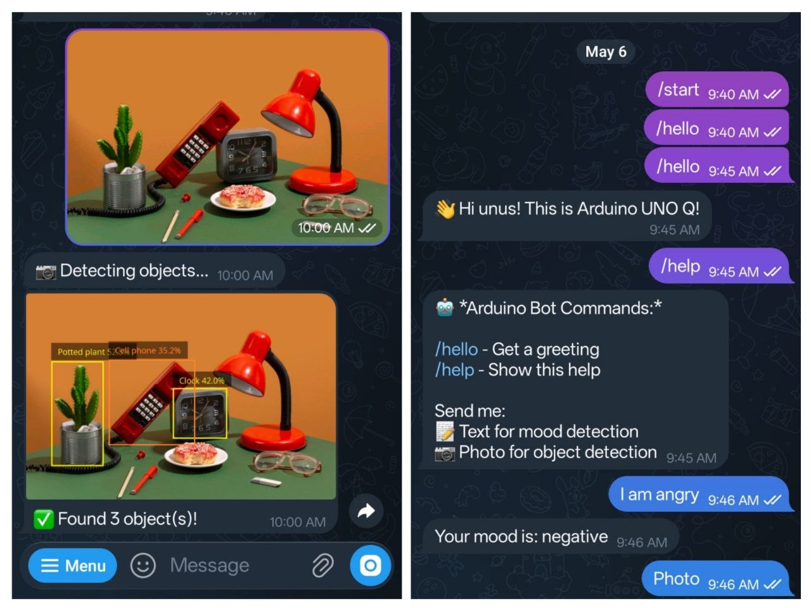
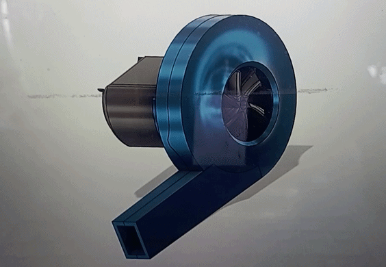
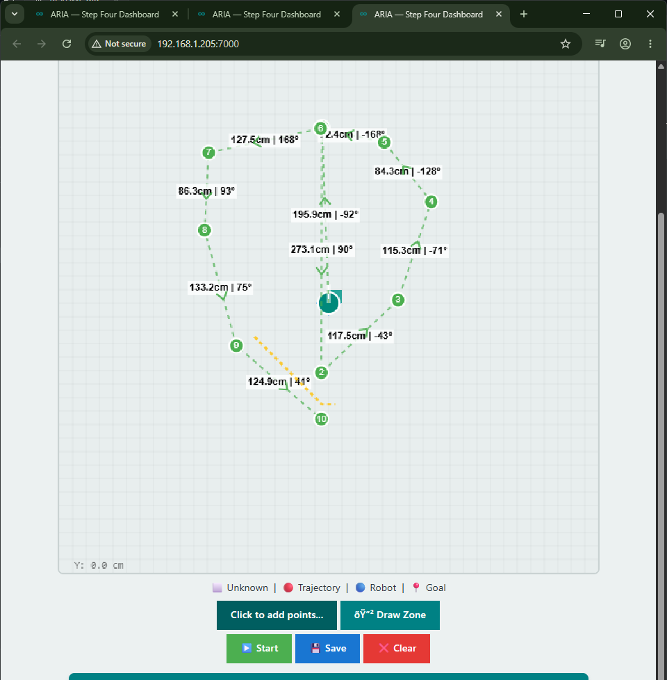
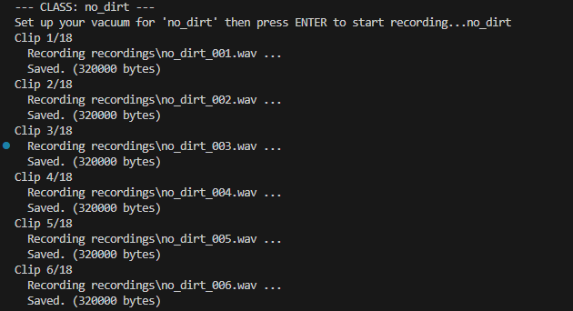

### Upload Image on the WebUI and get Object detection result 

### Or on the telegram Bot

### Live Webcam object detection from robot

### DIY Vacum

### Waypoint Following 

---
### NOTE
- Crontab can be used to startup teh socat connection automatically on reboot.  Socat creates a virtual serial port for the Arduino Uno Q container to communicaete with teh XRP controller over serial 
- `socat PTY,raw,echo=0,link=./xrp-serial TCP:localhost:8888`
 - 

 - The file xrp-Brute.cpp helps find the address of you IMU on the internal i2C bus in the XRP controller.  Please create a copy of the XRW platform.io project folder, and replace the main.cpp code in it with the code in xrp-Brute.cpp. Run it with your serial monitor open

- ARIA-step-four now gates EKF wheel odometry with IMU checks. Encoder ticks update `x/y` only when the accelerometer and gyroscope say the robot is in a trustworthy floor-contact state. The Control tab also shows wheel cm/s, acceleration norm, tilt, and the Odometry Gate state. XRP encoder scale is set to 585 counts/rev.
- Waypoint following now uses the same motor sign basis as the working manual controls: forward is `left=+speed,right=+speed`, left turn is `left=-speed,right=+speed`. Manual UI commands still use raw firmware command `M,left,right`; waypoint mode uses the new `XRW` autonomous command `A,left,right`, which balances left/right encoder wheel speeds.

# Edge Impulse 
## Data Collection — Vacuum Sound Classifier
### Overview
Records labelled vacuum audio clips from a **Seeed ReSpeaker Lite** (ESP32-S3)
and saves them as `.wav` files ready for upload to **Edge Impulse**.

### Hardware
- Seeed ReSpeaker Lite (XMOS + ESP32-S3)
- USB cable to PC
- Vacuum cleaner under test

### Files
| File | Purpose |
|---|---|
| `esp32s3-roomba-sound-collection/src/main.cpp` | PlatformIO firmware — streams raw PCM over serial |
| `recorder.py` | PC script — triggers recordings and saves `.wav` files |

### Setup

### 1. Flash the firmware

#### Dirt collection

## Demo 1 — Encoders, IMU, Vacuuming and Trajectory

This demo showcases ARIA's core capabilities running live on the Arduino UNO Q:

- 📐 **Encoders & IMU** — real-time wheel odometry and inertial measurement feeding the EKF pose estimator
- 🗺️ **Trajectory** — the robot following a path while the occupancy grid updates live in the web dashboard
- 🌀 **Vacuum control** — the L298N-driven vacuum motor being toggled and speed-adjusted via the web UI and Telegram bot
- 🔍 **Object detection** — the `VideoObjectDetection` brick identifying objects through the camera stream

src="https://www.youtube.com/embed/BKaiV54UXMU?si=G5n-rL69w6N3c07x" 
> **Demo1** — recorded on the Arduino UNO Q running ARIA-step-four.`

> **Demo2** — Using Project Aria-step-Four to deonstrate UI and Telegram control of the robot. src= "https://youtu.be/bRKg05knbhE"

