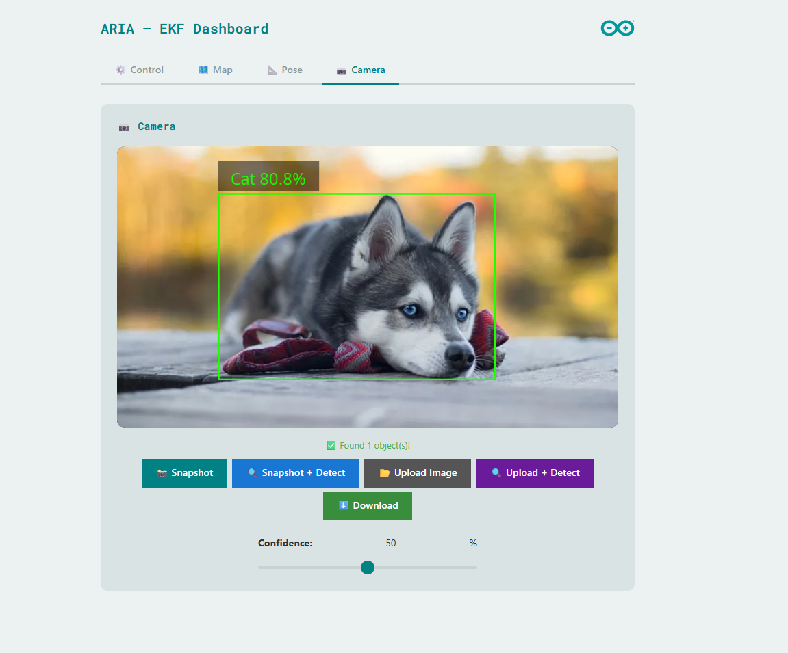
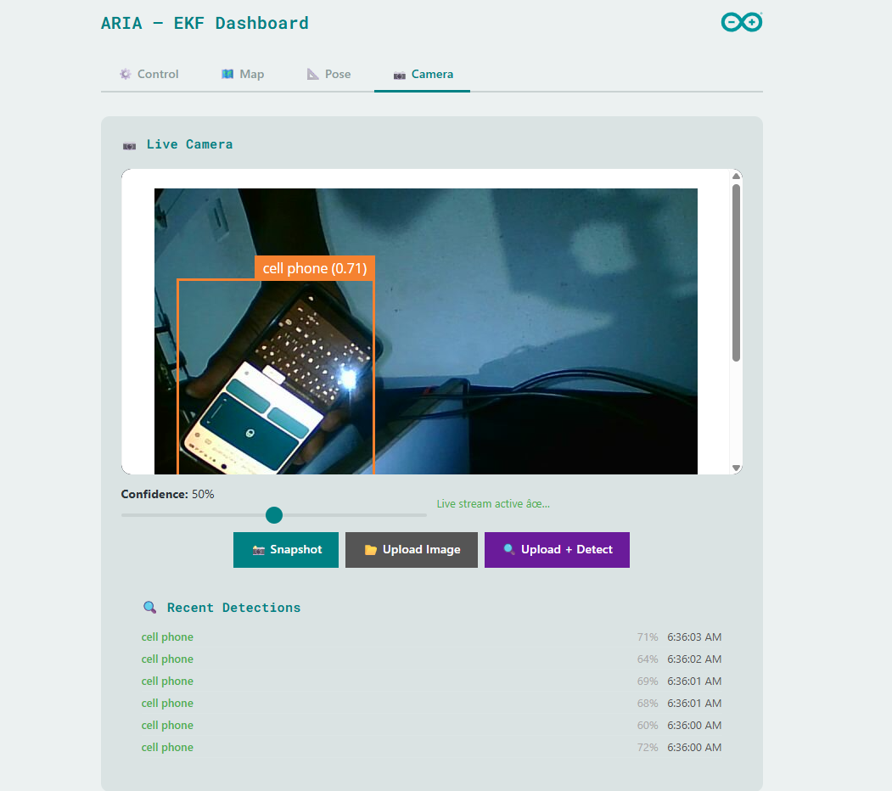
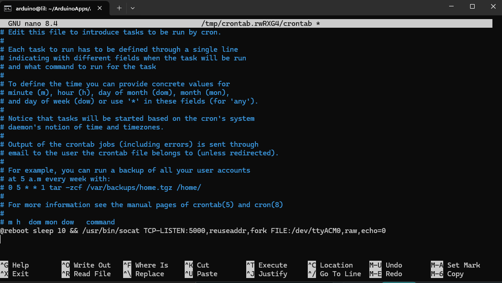

---
### NOTE
- Crontab can be used to startup teh socat connection automatically on reboot.  Socat creates a virtual serial port for the Arduino Uno Q container to communicaete with teh XRP controller over serial 
- `socat PTY,raw,echo=0,link=./xrp-serial TCP:localhost:8888`
 - 

 - The file xrp-Brute.cpp helps find the address of you IMU on the internal i2C bus in the XRP controller.  Please create a copy of the XRW platform.io project folder, and replace the main.cpp code in it with the code in xrp-Brute.cpp. Run it with your serial monitor open

## Demo 1 — Encoders, IMU, Vacuuming and Trajectory

This demo showcases ARIA's core capabilities running live on the Arduino UNO Q:

- 📐 **Encoders & IMU** — real-time wheel odometry and inertial measurement feeding the EKF pose estimator
- 🗺️ **Trajectory** — the robot following a path while the occupancy grid updates live in the web dashboard
- 🌀 **Vacuum control** — the L298N-driven vacuum motor being toggled and speed-adjusted via the web UI and Telegram bot
- 🔍 **Object detection** — the `VideoObjectDetection` brick identifying objects through the camera stream

src="https://www.youtube.com/embed/BKaiV54UXMU?si=G5n-rL69w6N3c07x" 
> **Demo1** — recorded on the Arduino UNO Q running ARIA-step-four.`

> **Demo2** — Using Project Aria-step-Four to deonstrate UI and Telegram control of the robot. src= "https://youtu.be/bRKg05knbhE"